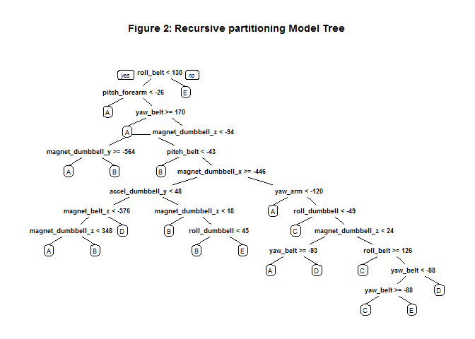
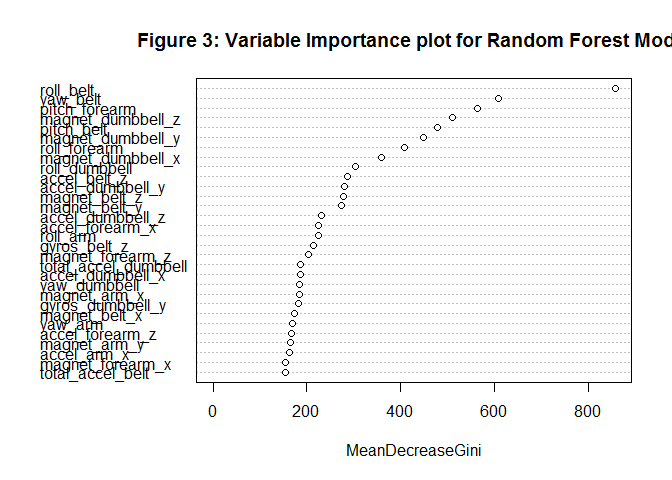

# Practical Machine Learning Course Project
Diane Leigh  
August 7, 2017  


## Background

Using devices such as Jawbone Up, Nike FuelBand, and Fitbit it is now possible to collect a large amount of data about personal activity relatively inexpensively. These type of devices are part of the quantified self movement - a group of enthusiasts who take measurements about themselves regularly to improve their health, to find patterns in their behavior, or because they are tech geeks. One thing that people regularly do is quantify how much of a particular activity they do, but they rarely quantify how well they do it. In this project, your goal will be to use data from accelerometers on the belt, forearm, arm, and dumbell of 6 participants. They were asked to perform barbell lifts correctly and incorrectly in 5 different ways. More information is available from the website here: http://groupware.les.inf.puc-rio.br/har (see the section on the Weight Lifting Exercise Dataset).

This human activity recognition research has traditionally focused on discriminating between different activities, i.e. to predict "which" activity was performed at a specific point in time (like with the Daily Living Activities dataset above). The approach we propose for the Weight Lifting Exercises dataset is to investigate "how (well)" an activity was performed by the wearer. The "how (well)" investigation has only received little attention so far, even though it potentially provides useful information for a large variety of applications,such as sports training.

In this work (see the paper) we first define quality of execution and investigate three aspects that pertain to qualitative activity recognition: the problem of specifying correct execution, the automatic and robust detection of execution mistakes, and how to provide feedback on the quality of execution to the user. We tried out an on-body sensing approach (dataset here), but also an "ambient sensing approach" (by using Microsoft Kinect - dataset still unavailable)

Six young health participants were asked to perform one set of 10 repetitions of the Unilateral Dumbbell Biceps Curl in five different fashions: 

Class A exactly according to the specification  
Class B throwing the elbows to the front  
Class C lifting the dumbbell only halfway  
Class D lowering the dumbbell only halfway   
Class E throwing the hips to the front  

Class A corresponds to the specified execution of the exercise, while the other 4 classes correspond to common mistakes. Participants were supervised by an experienced weight lifter to make sure the execution complied to the manner they were supposed to simulate. The exercises were performed by six male participants aged between 20-28 years, with little weight lifting experience. We made sure that all participants could easily simulate the mistakes in a safe and controlled manner by using a relatively light dumbbell (1.25kg).

Read more: http://webcache.googleusercontent.com/search?q=cache:http://groupware.les.inf.puc-rio.br/har#ixzz4oE68kWcT

The training data for this project are available here:
https://d396qusza40orc.cloudfront.net/predmachlearn/pml-training.csv

The test data are available here:
https://d396qusza40orc.cloudfront.net/predmachlearn/pml-testing.csv

The data for this project come from this source: http://groupware.les.inf.puc-rio.br/har. 

The goal of this project is to predict the manner in which they did the exercise. This is the "classe" variable (levels A, B, C, D, E) in the training set. 


```r
## Read training and testing data sets, replacing all empty cells with NA.
fileUrlTrain <- "https://d396qusza40orc.cloudfront.net/predmachlearn/pml-training.csv"
if(!file.exists("Training.csv")){
     download.file(fileUrlTrain, "Training.csv")
     dateTrainingDownloaded <- date()
}
training <- read.csv("Training.csv", na.strings=c('','NA'))

fileUrlTest <- "https://d396qusza40orc.cloudfront.net/predmachlearn/pml-testing.csv"
if(!file.exists("Testing.csv")){
     download.file(fileUrlTest, "Testing.csv")
     dateTestingDownloaded <- date()
}

testing <- read.csv("Testing.csv", na.strings=c('','NA'))

numNAs <- NULL
for(i in 1:ncol(training)){
     numNAs[i] <- sum(is.na(training[,i]))
}
```

Training data was downloaded: Mon Aug 07 09:29:30 2017
Testing data was downloaded: Mon Aug 07 09:29:32 2017

## Clean up the data:
There are 160 variables in the testing set. However, many of these variables have a large proportion of NAs. 

###Table 1: Number of NAs per column

```r
numNAs
```

```
##   [1]     0     0     0     0     0     0     0     0     0     0     0
##  [12] 19216 19216 19216 19216 19216 19216 19216 19216 19216 19216 19216
##  [23] 19216 19216 19216 19216 19216 19216 19216 19216 19216 19216 19216
##  [34] 19216 19216 19216     0     0     0     0     0     0     0     0
##  [45]     0     0     0     0     0 19216 19216 19216 19216 19216 19216
##  [56] 19216 19216 19216 19216     0     0     0     0     0     0     0
##  [67]     0     0 19216 19216 19216 19216 19216 19216 19216 19216 19216
##  [78] 19216 19216 19216 19216 19216 19216     0     0     0 19216 19216
##  [89] 19216 19216 19216 19216 19216 19216 19216 19216 19216 19216 19216
## [100] 19216 19216     0 19216 19216 19216 19216 19216 19216 19216 19216
## [111] 19216 19216     0     0     0     0     0     0     0     0     0
## [122]     0     0     0 19216 19216 19216 19216 19216 19216 19216 19216
## [133] 19216 19216 19216 19216 19216 19216 19216     0 19216 19216 19216
## [144] 19216 19216 19216 19216 19216 19216 19216     0     0     0     0
## [155]     0     0     0     0     0     0
```

A subset of both the training and testing data containing only those variables without NAs will be used for the model building and testing. Columns containing identification information (1-7) only are also removed.

```r
trainsub <- training[,!apply(training,2,function(x) any(is.na(x)))]
testsub <- testing[,!apply(testing,2,function(x) any(is.na(x)))]

# remove columns containing identification only variables (1 to 6)
trainset <- trainsub[, -(1:7)]
testset  <- testsub[, -(1:7)]
```

**Note:** Both the training set and the testing set have 53 variables. However there is no classe variable in the testing set. There is a variable named problem_id in the testing set.

## Building the model
### Cross-Validation
To allow for validation of the model prior to using it to assess the 20 test cases, we will split the data 70:30 into a training set and a validation set. The training set will be used to build the model and the validation set will be used to estimate the out of sample error rate via the confusion matrix (~ 1- accuracy).


```r
## separate training set into both a training set(70%) and a validation set(30%).
set.seed(8918)
intrain <- createDataPartition(y = trainset$classe, p = 0.7, list = F)
train <- trainset[intrain,]
validation <- trainset[-intrain,]
```
We now have 53 predictor variable plus the classe variable in our training and validation sets. lets look for any correllation between the predictor variables.


```r
corMatrix <- cor(trainset[, -53])
corrplot(corMatrix, order = "FPC", method = "color", type = "lower",
         tl.cex = 0.8, tl.col = rgb(0, 0, 0), mar=c(0,0,2,0), 
         title = "Figure 1: Correlation Matrix for Remaining Predictor Variables")
```

<!-- -->

High correlation is associated with dark blue color, which we do not see in the plot, so we will keep the remaining 53 predictor variables for the model building process.

Recursive partitioning, Random Forest and Generalized Boosted methods will be used to define prediction models based on the train data set, and then tested on the validation data set. The model with the highest accuracy will then be appllied to the testsub data set.


```r
set.seed(48648)
tree.train <- rpart(classe~., train, method = "class")
prp(tree.train, main = "Figure 2: Recursive partitioning Model Tree")
```

<!-- -->

```r
tree.pred <- predict(tree.train , validation ,type="class")
cmtree <- confusionMatrix(tree.pred, validation$classe)
cmtree
```

```
## Confusion Matrix and Statistics
## 
##           Reference
## Prediction    A    B    C    D    E
##          A 1502  221   36   50   81
##          B   42  554   47   67   22
##          C   28  112  696   56   45
##          D   86  116  197  698  155
##          E   16  136   50   93  779
## 
## Overall Statistics
##                                           
##                Accuracy : 0.7186          
##                  95% CI : (0.7069, 0.7301)
##     No Information Rate : 0.2845          
##     P-Value [Acc > NIR] : < 2.2e-16       
##                                           
##                   Kappa : 0.6431          
##  Mcnemar's Test P-Value : < 2.2e-16       
## 
## Statistics by Class:
## 
##                      Class: A Class: B Class: C Class: D Class: E
## Sensitivity            0.8973  0.48639   0.6784   0.7241   0.7200
## Specificity            0.9079  0.96249   0.9504   0.8874   0.9386
## Pos Pred Value         0.7947  0.75683   0.7428   0.5575   0.7253
## Neg Pred Value         0.9569  0.88647   0.9333   0.9426   0.9370
## Prevalence             0.2845  0.19354   0.1743   0.1638   0.1839
## Detection Rate         0.2552  0.09414   0.1183   0.1186   0.1324
## Detection Prevalence   0.3212  0.12438   0.1592   0.2127   0.1825
## Balanced Accuracy      0.9026  0.72444   0.8144   0.8057   0.8293
```


```r
set.seed(48648)
rndfst.train <- randomForest(classe ~ ., train)
varImpPlot(rndfst.train, main = "Figure 3: Variable Importance plot for Random Forest Model")
```

<!-- -->

```r
rndfst.pred <- predict(rndfst.train, validation, type = "class")
cmrndfst <- confusionMatrix(rndfst.pred, validation$classe)
cmrndfst
```

```
## Confusion Matrix and Statistics
## 
##           Reference
## Prediction    A    B    C    D    E
##          A 1671    9    0    0    0
##          B    3 1129    1    0    0
##          C    0    1 1021   16    0
##          D    0    0    4  947    3
##          E    0    0    0    1 1079
## 
## Overall Statistics
##                                           
##                Accuracy : 0.9935          
##                  95% CI : (0.9911, 0.9954)
##     No Information Rate : 0.2845          
##     P-Value [Acc > NIR] : < 2.2e-16       
##                                           
##                   Kappa : 0.9918          
##  Mcnemar's Test P-Value : NA              
## 
## Statistics by Class:
## 
##                      Class: A Class: B Class: C Class: D Class: E
## Sensitivity            0.9982   0.9912   0.9951   0.9824   0.9972
## Specificity            0.9979   0.9992   0.9965   0.9986   0.9998
## Pos Pred Value         0.9946   0.9965   0.9836   0.9927   0.9991
## Neg Pred Value         0.9993   0.9979   0.9990   0.9966   0.9994
## Prevalence             0.2845   0.1935   0.1743   0.1638   0.1839
## Detection Rate         0.2839   0.1918   0.1735   0.1609   0.1833
## Detection Prevalence   0.2855   0.1925   0.1764   0.1621   0.1835
## Balanced Accuracy      0.9980   0.9952   0.9958   0.9905   0.9985
```


```r
set.seed(48648)
bstcntl <- trainControl(method = "repeatedcv", number = 5, repeats = 1)
gbm.train <- train(classe ~ ., train, method = "gbm", trControl = bstcntl,
                 verbose = FALSE)
gbm.pred <- predict(gbm.train, validation)
cmgbm <- confusionMatrix(gbm.pred, validation$classe)
cmgbm
```

```
## Confusion Matrix and Statistics
## 
##           Reference
## Prediction    A    B    C    D    E
##          A 1645   41    0    3    2
##          B   19 1062   24    3    7
##          C    5   31  985   31    7
##          D    4    5   15  923   17
##          E    1    0    2    4 1049
## 
## Overall Statistics
##                                           
##                Accuracy : 0.9624          
##                  95% CI : (0.9573, 0.9672)
##     No Information Rate : 0.2845          
##     P-Value [Acc > NIR] : < 2.2e-16       
##                                           
##                   Kappa : 0.9525          
##  Mcnemar's Test P-Value : 3.332e-05       
## 
## Statistics by Class:
## 
##                      Class: A Class: B Class: C Class: D Class: E
## Sensitivity            0.9827   0.9324   0.9600   0.9575   0.9695
## Specificity            0.9891   0.9888   0.9848   0.9917   0.9985
## Pos Pred Value         0.9728   0.9525   0.9301   0.9575   0.9934
## Neg Pred Value         0.9931   0.9839   0.9915   0.9917   0.9932
## Prevalence             0.2845   0.1935   0.1743   0.1638   0.1839
## Detection Rate         0.2795   0.1805   0.1674   0.1568   0.1782
## Detection Prevalence   0.2873   0.1895   0.1799   0.1638   0.1794
## Balanced Accuracy      0.9859   0.9606   0.9724   0.9746   0.9840
```


```r
modelacc <- as.data.frame(rbind(cmtree$overall, cmrndfst$overall, cmgbm$overall), row.names = c("Recursive partitioning", "Random Forest", "Generalized Boosting"))
xt <- xtable(modelacc, caption = "Table 3: Comparison of Prediction Models", align = "cccccccc")
print(xt, type = "html", include.rownames = TRUE, caption.placement = "top")
```

<!-- html table generated in R 3.4.0 by xtable 1.8-2 package -->
<!-- Mon Aug 07 09:34:03 2017 -->
<table border=1>
<caption align="top"> Table 3: Comparison of Prediction Models </caption>
<tr> <th>  </th> <th> Accuracy </th> <th> Kappa </th> <th> AccuracyLower </th> <th> AccuracyUpper </th> <th> AccuracyNull </th> <th> AccuracyPValue </th> <th> McnemarPValue </th>  </tr>
  <tr> <td align="center"> Recursive partitioning </td> <td align="center"> 0.72 </td> <td align="center"> 0.64 </td> <td align="center"> 0.71 </td> <td align="center"> 0.73 </td> <td align="center"> 0.28 </td> <td align="center"> 0.00 </td> <td align="center"> 0.00 </td> </tr>
  <tr> <td align="center"> Random Forest </td> <td align="center"> 0.99 </td> <td align="center"> 0.99 </td> <td align="center"> 0.99 </td> <td align="center"> 1.00 </td> <td align="center"> 0.28 </td> <td align="center"> 0.00 </td> <td align="center">  </td> </tr>
  <tr> <td align="center"> Generalized Boosting </td> <td align="center"> 0.96 </td> <td align="center"> 0.95 </td> <td align="center"> 0.96 </td> <td align="center"> 0.97 </td> <td align="center"> 0.28 </td> <td align="center"> 0.00 </td> <td align="center"> 0.00 </td> </tr>
   </table>

##Conclussion
The Random Forest Model gave the highest accuracy rate for the validation set, and will now be used to assign the classe variable to the test set.


```r
test.pred <- predict(rndfst.train, testset, type = "class")
test.pred
```

```
##  1  2  3  4  5  6  7  8  9 10 11 12 13 14 15 16 17 18 19 20 
##  B  A  B  A  A  E  D  B  A  A  B  C  B  A  E  E  A  B  B  B 
## Levels: A B C D E
```

